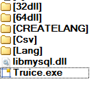
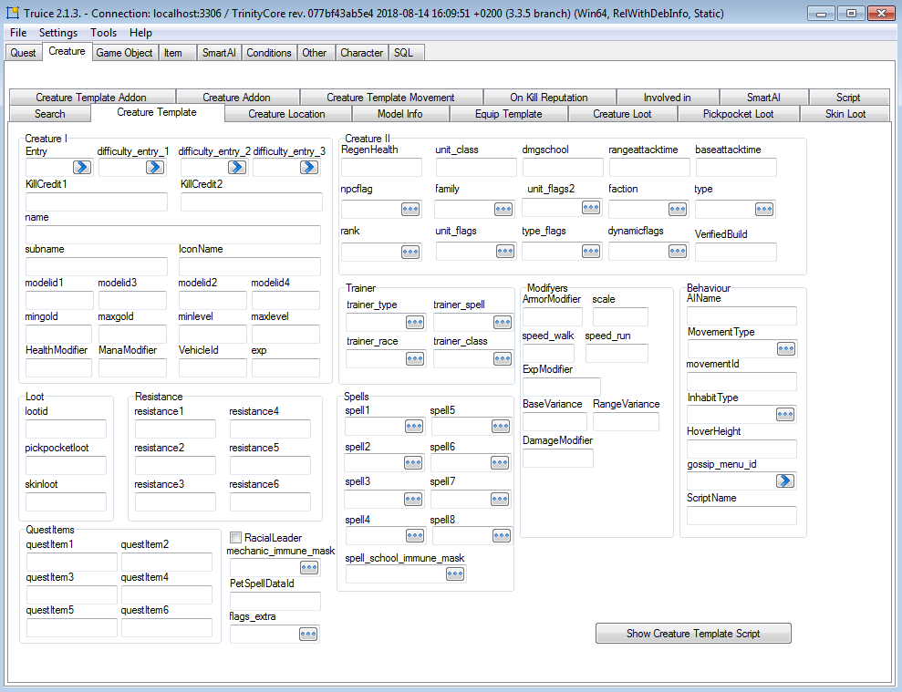
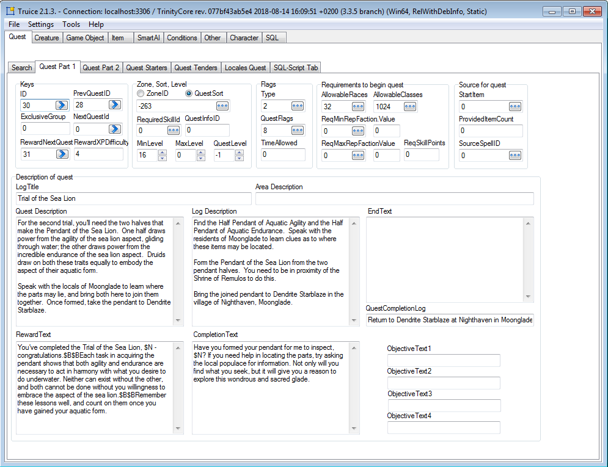
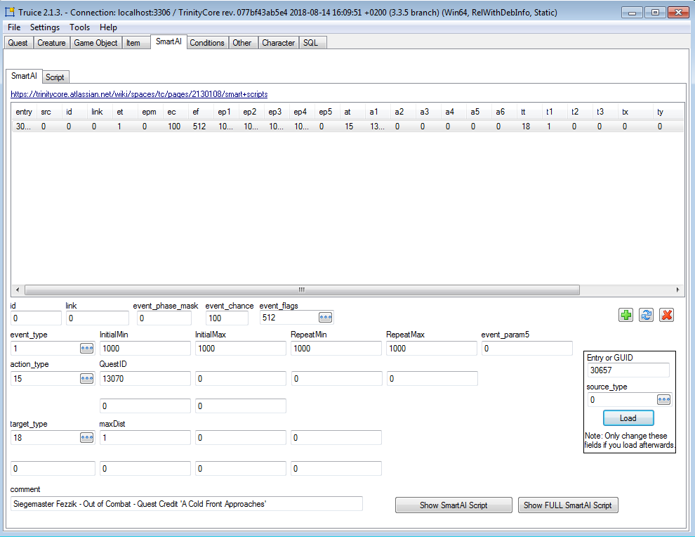

Truice
=============

Truice is a database editor specifically made for TrinityCore. It is a fork of Quice, which was made for MaNGoS.

You can edit quests, creatures, gameobjects, items, loot, SmartAI (smart_scripts), conditions and some minor things.

It is written in Delphi, source on github compiled using Embarcadero Delphi 10.2.2 (Tokyo) and the source is available under https://github.com/Faq/Truice
and precompiled binaries under https://github.com/Faq/Truice/releases

**How To run:**
1. choose 32 bit or 64 and copy "libmysql.dll" and "Truice.exe" outside folder (where are all other folders: CSV, Lang etc.);
2. run "Truice.exe"
3. dll files are from MySQL v5.7.23
4. if You got it right, then it should be like this:

**To compile use:** 
Delphi XE2+ (there is Community Edition of Delphi what is completely free https://www.embarcadero.com/products/delphi/starter)

and these additional components:

A) JEDI Visual Component Library 3.5
http://jvcl.delphi-jedi.org/
http://jvcl.sourceforge.net/daily/
http://github.com/project-jedi/jvcl

B) JEDI Code Library 2.9
http://sourceforge.net/projects/jcl/
http://jcl.sourceforge.net/daily/
http://github.com/project-jedi/jcl

C) Droping ZeosLib to use Delphi internal db component FireDAC (from 22.08.2018).

ZeosDBO 7.3 from testing branch (SVN rev4068) (last commit with ZeosLib https://github.com/Faq/Truice/commit/3e74ac4aececd7b4c55b607ca9c3b63eb85f3a17)
http://sourceforge.net/projects/zeoslib/ (new link)
http://svn.code.sf.net/p/zeoslib/code-0

**Original topic on TC forum:**
https://community.trinitycore.org/topic/13899-truice-2018-win32/

**Truice Download:**
https://github.com/Faq/Truice/releases

Author: Faq
